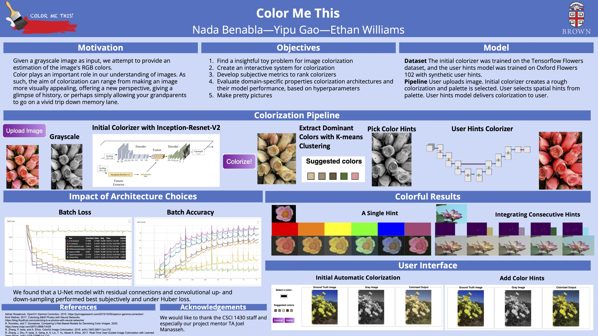
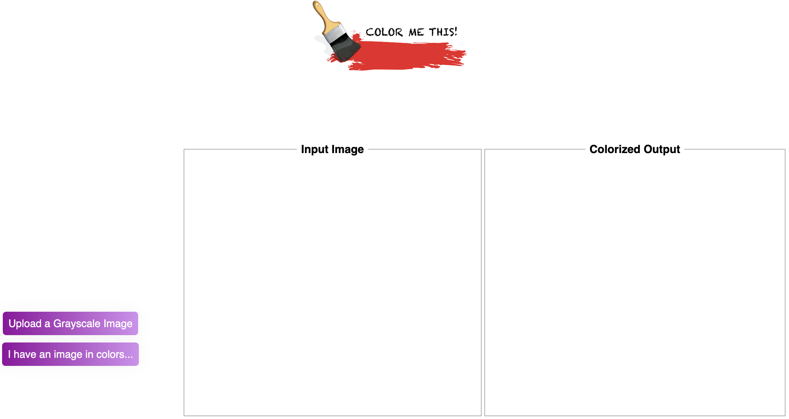
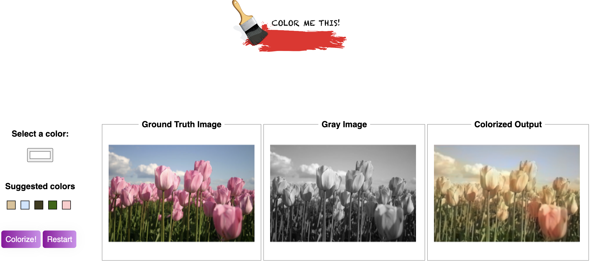

# **CSCI 1430 Final Project: Colorization**

See demo below:
https://github.com/EtomicBomb/cs143-final-project-proposal/assets/77747926/7c045078-7d2f-4961-923e-5c24f9f29e3e

### **Poster**

### **Instructions to try the model locally with the UI**

First, Download the CNN encoder-decoder model with Inception-ResNet-V2 with the following command:
`gdown --fuzzy 'https://drive.google.com/file/d/1EZELjypMQbp2qFXuXlBUD-E9HIirZiXr/view?usp=share_link'`

Download the U-Net model for user-guided colorization with the following command:

`gdown --fuzzy 'https://drive.google.com/file/d/14tPr3DZnn-PmxijRKbQq1dQ6E46B3H3V/view?usp=share_link'`

Make sure both of these files are located in `src/check`.

Next, navigate to src/ui/ and run `python3 app.py` to start the Flask app. Open the `src/ui/initial_ui.html` in your browser of choice. 

You should be directed to the page shown below.

Upload a grayscale image to start colorizing. If you want to start with a colorized image and compare your ground truth image to our colorized output, click on "I have an image in colors...". You will be redirected to the page below.

1) Upload your image.
2) Click "Colorize!" to see the result of the automatic colorization with the CNN/Inception-ResNet-V2 model.
3) Choose colors from either the RGB color picker labeled "Select a color", or from the palette of suggested colors.
4) Draw your color hints on the gray-scale image.
5) You should be able to see a colorized output in real-time after every added color hint!

